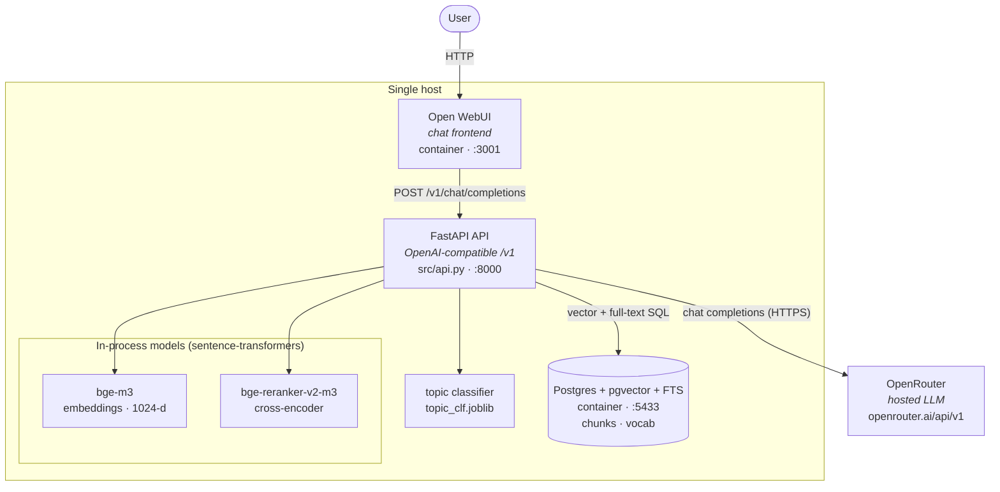
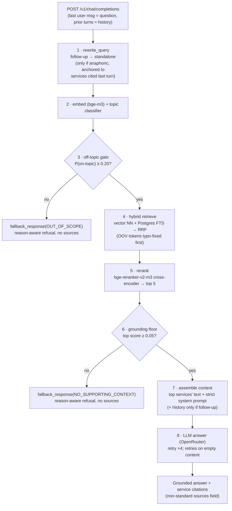
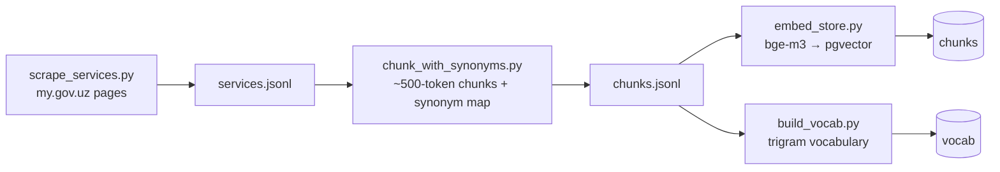

# Architecture

This document describes the runtime and the offline corpus build for the my.gov.uz RAG
system, and the request lifecycle of a single question. It reflects the **implemented**
system — a single-node deployment whose only external dependency is a hosted LLM
(OpenRouter). Where this document and the code disagree, the code wins — open an issue.

---

## 1. Service topology



**Why it is this small.** The LLM is hosted (OpenRouter), so there is no local
inference server to run. The embedding and reranker models are loaded once into the API
process via `sentence-transformers` — a separate embedding microservice would add a network
hop and a second copy of the weights for no benefit at this scale. Conversation state lives
in the UI: Open WebUI stores each chat and replays the full `messages` array every request,
so there is no server-side session store (no Redis). Everything scales vertically on one box
until traffic says otherwise.

| Component | Role | Port | Where |
| --- | --- | :---: | --- |
| Open WebUI | Chat frontend; holds sessions; speaks OpenAI `/v1` | 3001 | Docker (`mygov-webui`) |
| FastAPI API | `GET /v1/models`, `POST /v1/chat/completions`, `GET /health` | 8000 | `src/api.py` |
| Postgres + pgvector | Chunk store (vector + FTS) and typo-fix vocabulary | 5433 | Docker (`mygov-pg`) |
| bge-m3 | Query/passage embeddings (1024-d, cosine) | — | in-process |
| bge-reranker-v2-m3 | Cross-encoder reranking of candidates | — | in-process |
| topic classifier | Logistic regression over the query embedding | — | `topic_clf.joblib` |
| OpenRouter | Answer generation + follow-up rewrite | — | hosted |

---

## 2. Request lifecycle

The entrypoint is `rerank.answer(question, history)`, called by `POST /v1/chat/completions`
(`src/api.py`). The two grounding gates run **before** the LLM is ever called.



| # | Step | Code | Notes |
| :-: | --- | --- | --- |
| 1 | Follow-up rewrite | `rewrite_query` | Fires only for anaphoric/very short questions; anchored to the services cited in the previous answer so *"bu xizmat"* resolves to the primary one. Runs at `temperature=0`; degrades to the raw question on any error. |
| 2 | Embed + classify | `rag._embedder`, `topic_clf` | One `bge-m3` embedding feeds both the classifier and retrieval. |
| 3 | Off-topic gate | `CLF_OFFTOPIC = 0.20` | Refuses *before* retrieval/LLM — catches "what's the weather?". |
| 4 | Hybrid retrieve | `src/hybrid.py` | Vector nearest-neighbour (meaning) + Postgres full-text (exact words), fused with Reciprocal Rank Fusion. OOV query tokens are spell-corrected against the `vocab` trigram table first. |
| 5 | Rerank | `rerank()` | Cross-encoder reads each (query, chunk) pair together → sharper top-5. |
| 6 | Grounding floor | `GATE_FLOOR = 0.05` | If the best reranked chunk scores below the floor, refuse instead of answering from weak context. |
| 7 | Context assembly | `rag.build_context` | Only the top services' plain text + a strict system prompt. History is included **only for a genuine follow-up**, to avoid a topic switch dragging the previous topic into the answer. |
| 8 | LLM answer | `rag._client` (OpenRouter) | Answer strictly from context; always cite service name + URL. Retries up to 4× and treats empty content as retriable. |

Both refusal paths return **no** `sources`, so a "not found" reply never shows misleading
citations. The two reasons are kept apart on purpose:

- **`OUT_OF_SCOPE`** — the classifier judges the question isn't a my.gov.uz topic.
- **`NO_SUPPORTING_CONTEXT`** — plausibly on-topic, but retrieval found nothing that grounds
  an answer.

Each refusal is phrased by a single **guarded** LLM call (`fallback_response`) that
acknowledges the question without answering it and **degrades to a fixed per-reason
sentence** on any error, empty output, or over-long reply — so the refusal path can never
error, stall, or hallucinate.

---

## 3. Data model (Postgres)

Built by the offline pipeline; read by `src/hybrid.py` and `src/rag.py`.

```
chunks
  chunk_id    INTEGER PRIMARY KEY   -- one row per ~500-token chunk
  service_id  INTEGER NOT NULL      -- my.gov.uz service the chunk belongs to
  title       TEXT                  -- service title (prepended to embed_text)
  url         TEXT                  -- canonical my.gov.uz/uz/service/<id> link
  lang        TEXT                  -- uz / ru
  keywords    TEXT                  -- injected synonyms + salient terms
  text        TEXT                  -- chunk body
  embedding   vector(1024)          -- bge-m3, cosine        → ANN index chunks_emb_idx
  fts         tsvector GENERATED    -- title+keywords+text   → GIN index (full-text search)

vocab                               -- powers query typo-fix (pg_trgm)
  word        TEXT PRIMARY KEY      -- every real corpus token
  ndoc        INTEGER               -- document frequency    → GIN trigram index on word
```

Retrieval issues two queries over `chunks` — `ORDER BY embedding <=> $qv` (vector) and
`ORDER BY ts_rank(fts, plainto_tsquery(...))` (full-text) — and fuses their ranked lists
with RRF. `vocab` is consulted only to repair out-of-vocabulary query tokens before the
full-text search runs.

---

## 4. Offline corpus build

Run once, in order, from the repo root. The repo ships `data/chunks.jsonl`, so scraping is
optional.



- **`scrape_services.py`** — server-rendered service pages → one JSON record per service.
- **`chunk_with_synonyms.py`** — split into ~500-token chunks on sentence boundaries with a
  small overlap; inject a hand-curated synonym map so loanwords people actually type
  (*tonirovka*, *propiska*) become findable.
- **`embed_store.py`** — embed each chunk with `bge-m3` and `TRUNCATE`-then-reload the
  `chunks` table.
- **`build_vocab.py`** — rebuild the `vocab` trigram table from the corpus (idempotent).

---

## 5. Design decisions & non-goals

- **Hosted LLM, not local inference.** OpenRouter removes a GPU-serving component from the
  runtime. The two retrieval models are small enough to co-locate in the API process.
- **UI-held sessions.** Open WebUI replays full history each turn, so the server stays
  stateless — no session store, no Redis.
- **Gates before the model.** Trust comes from refusing early (classifier) and refusing on
  weak evidence (grounding floor), not from asking the LLM to police itself.
- **Thresholds are calibrated, not guessed.** `CLF_OFFTOPIC` and `GATE_FLOOR` are tuned from
  logged decisions (`MYGOV_QUERY_LOG` → `eval/calibrate.py`).
- **Not in scope (single-node design):** an API gateway / rate-limiter tier, a separate
  embedding/rerank microservice, a local inference server, and a distributed session store.
  These belong to a horizontally-scaled deployment; this repo targets one host.
